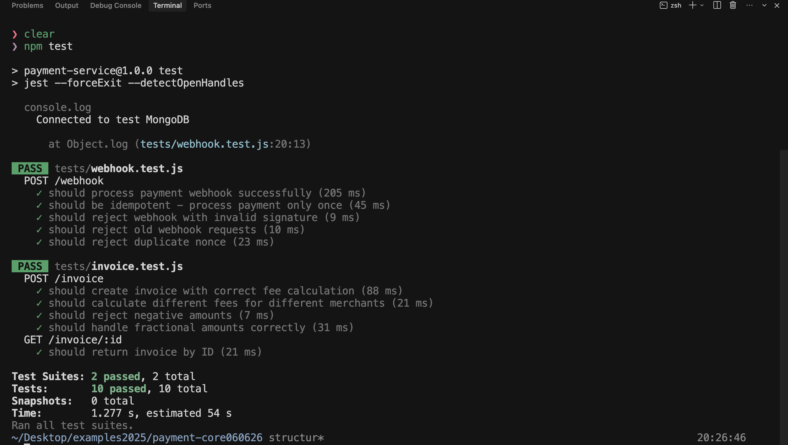

# payment-core

## Решение с MongoDB для РФ
Вместо Atlas (который заблокирован) используем MongoDB локально. Установка простая:

**На Ubuntu/Debian:**
```bash
# Импорт ключа и установка
wget -qO - https://www.mongodb.org/static/pgp/server-7.0.asc | sudo apt-key add -
echo "deb [ arch=amd64,arm64 ] https://repo.mongodb.org/apt/ubuntu jammy/mongodb-org/7.0 multiverse" | sudo tee /etc/apt/sources.list.d/mongodb-org-7.0.list
sudo apt-get update
sudo apt-get install -y mongodb-org
sudo systemctl start mongod
```
**На macOS:** - использовал для установки на m1
```bash
brew tap mongodb/brew
brew install mongodb-community@7.0
brew services start mongodb-community
```
**На Windows:** <br/>
Скачать с официального сайта и установить как службу. **Доступ для пользователей РФ заблокирован**
```text
https://www.mongodb.com/try/download/community
```

**Установка:**
```bash
npm install
```
**Требования**
- > Node.js 18+

- > MongoDB 7.0 (локально)

- > Redis (локально)

**Установка MongoDB:**
```text
Ubuntu: sudo apt install mongodb-org

macOS: brew install mongodb-community

Windows: скачать с mongodb.com
```

**Установка Redis:**
```text
Ubuntu: sudo apt install redis-server

macOS: brew install redis
```

**Запуск*
- Удалите расширение .you а файле .env

**Запустите MongoDB и Redis**
```bash
npm start
```
**Результат выполнения команды:**
```text
> payment-service@1.0.0 start
> node src/app.js

Connected to MongoDB
Server running on port 3000
```

## API Endpoints
- > POST /invoice

Создание счёта:
```text
{
  "amount": 100.00,
  "currency": "RUB",
  "merchantId": "merchant_001"
}
```

- > POST /webhook
Приём статуса оплаты<br/>
Headers: X-Signature, X-Timestamp, X-Nonce
```text
{
  "invoiceId": "...",
  "status": "paid"
}
```

- > GET /invoice/:id
Получение статуса счёта


**Тесты**

```bash
npm test
```

**результат выполнения команды:**

   <p align="center">
  		
   </p>


**Допущения**

- Комиссия хранится в конфигурации (в реальном проекте в БД)

- Для тестов используется MongoDB Memory Server

- Для тестов Redis мокается через ioredis-mock
- В системе принято допущение, что все финансовые расчеты внутри базы данных ведутся строго в минимальных денежных единицах (копейках/центах) в формате Integer, чтобы избежать ошибок округления чисел с плавающей точкой (Float) в JavaScript
- Для защиты от атак повторения (Replay attacks) используется кэш Redis со сроком жизни nonce в 1 час. Предполагается, что время на сервере платежной системы и нашем сервере синхронизировано (допустимое окно — 5 минут)
- В рамках выполнения работы аутентификация мерчантов при создании инвойса упрощена: мы доверяем merchantId из тела запроса. В реальном продакшене этот запрос должен быть закрыт авторизационным токеном (Bearer JWT)
- Если вебхук пришел повторно для уже оплаченного счета, система отвечает статусом 200 и сообщением "Already processed", обеспечивая тем самым свойство идемпотентности


## Сверх требований
- JSDoc на всех методах
- .env.you для удобной настройки(убрать расширение .you)
- REQUIREMENTS.md отдельным файлом(ТЗ)

**Структура проекта:**
```text
payment-core060626/
├── src/
│   ├── config/
│   │   └── merchants.js
│   ├── models/
│   │   └── Invoice.js
│   ├── services/
│   │   ├── invoiceService.js
│   │   └── webhookService.js
│   ├── routes/
│   │   ├── invoice.js
│   │   └── webhook.js
│   ├── utils/
│   │   └── currency.js
│   └── app.js
├── tests/
│   ├── setup.js
│   ├── invoice.test.js
│   └── webhook.test.js
├── .env.you
├── package.json
├── jest.config.js
├── REQUIREMENTS.md
└── README.md
```


